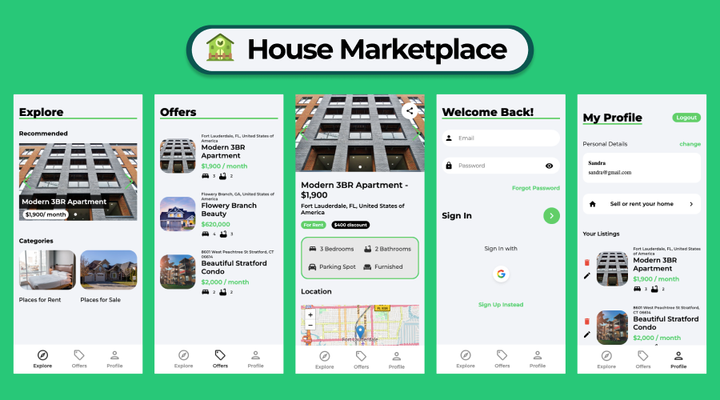

# House Marketplace React App

## Welcome! 👋

This project was coded during the course "React Front to Back 2022" by Brad Traversy. The goal was to build a House Marketplace using React 18 (Frontend) and Firebase 9 (Backend).

## Table of contents

- [Overview](#overview)
  - [The challenge](#the-challenge)
- [My process](#my-process)
  - [Built with](#built-with)
- [Author](#author)

## Overview

### The challenge

- Create a mobile React App that allows users to list houses/apartments for rent/sale.

- Features:

1. Sign up and login functionality (email and Google OAuth): Firebase Authentication
2. Create listings with upload images feature: Firestore Database and Storage
3. Delete and edit user listings
4. Display listings with information and location using Leaflet
5. Contact landlord feature allowing users to send messages through email
6. Slider showing the most recent listings on the home page (Swiperjs)
7. React Toastify notifications

## My process

### Built with

- React Hooks (useEffect, useState, ...)
- React Router 6
- Firebase 9: Authentication, Firestore Database and Storage
- [Leaflet](https://leafletjs.com/)
- [Swiperjs](https://swiperjs.com/get-started)
- [React Toastify](https://www.npmjs.com/package/react-toastify)

## Author

Coded by José Pessoa 🧪 💻
